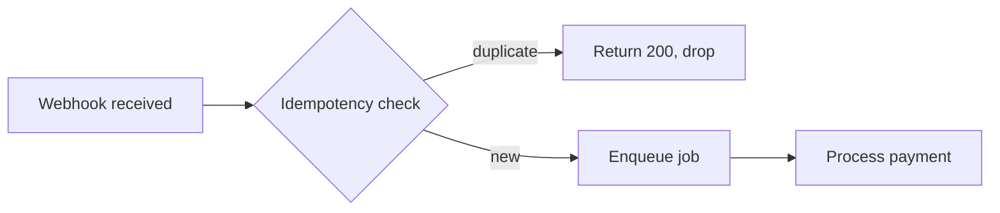
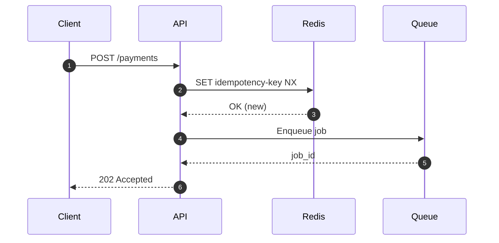
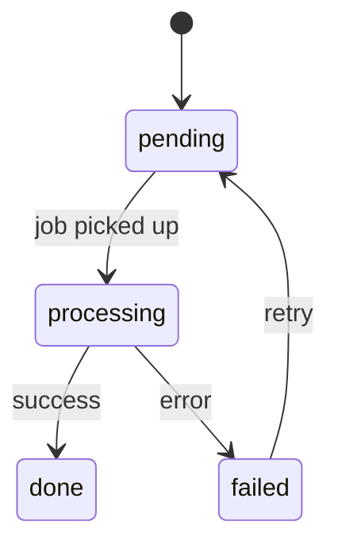

# Engineering vault

This folder is an Obsidian vault used to run **projects** — units of focused work that can span multiple Linear tickets and gather investigations, agents' plans, decisions, and documents in one place. WorktreeManager created it and writes task logs into it; you own everything else.

**Code repos do not live in the vault.** They stay wherever you keep them —
the [[#Repos]] index below maps each repo to its path.

---

## Repos

Add a row for each repo you work on — where it's cloned and a short
description of its role in your stack. This index is how agents map a repo
name to a location, so keep it current.

| Repo   | Path              | Description                                    |
| ------ | ----------------- | ---------------------------------------------- |
| my-api | `~/code/my-api`   | Example — replace with your repos              |
| my-web | `~/code/my-web`   | Example — replace with your repos              |

---

## How we work

The typical flow for multi-ticket, cross-repo, or research-heavy task: Open or create a project in the vault (`projects/`). Use the scaffold script:

   ```bash
   bash <vault>/scripts/new-project.sh <slug> [--tickets PROJ-1,PROJ-2]
   ```

Use the vault to store plans, investigations, decisions, and documents that shouldn't live in any single repo.


---

## Conventions

- **Repos** — live wherever you keep them, one folder per repo. Never clone a
  repo inside the vault (it's notes-only and may be synced), and do not nest
  repos inside each other.
- **Worktrees** — managed by the **WorktreeManager** app, which keeps them in a
  central store *outside* the repos:
  `~/Documents/.worktreemanager/worktrees/<repo>/<branch>` (e.g.
  `~/Documents/.worktreemanager/worktrees/my-api/proj-123-fix-webhook-retries`).
  **Agents never create worktrees** — they are always created from the app, by the
  user. Don't run `git worktree add`, don't use the `EnterWorktree` tool, and don't
  hand-roll them under `<repo>/.claude/worktrees/` or as siblings of the repo. If
  work needs a worktree that doesn't exist yet, ask the user to create it in the app.
  To find existing ones: `git -C <repo-path> worktree list`.
- **Secrets** — never put credentials, `.env` files, or tokens in the vault.
  The vault may be synced via Obsidian Sync.
- **Vault internals** — do not commit or modify `.obsidian/`; it is managed by
  Obsidian.
- **Repo hygiene** — each repo manages its own `CLAUDE.md`/`AGENTS.md` for
  project-specific instructions.

---

## Language rule (critical)

> **Vault language: English**

The line above is the setting — change `English` to `Spanish` if you prefer
your notes in Spanish. Pick one and keep the whole vault consistent.

All vault content is written in the configured language — note bodies, titles,
frontmatter values, investigations, plans, decisions, and document prose. This
is a local knowledge base, not GitHub-facing content, so team language rules
for commits/PRs/issues do **not** apply here. Structural tokens stay in English
regardless of the setting — frontmatter keys, `status:`/`type:` values, folder
names, and template headings — so scripts, search, and queries keep working.

---

## Prose formatting (no hard wrapping)

Prose is **not** hard-wrapped — one line per paragraph/bullet, blank line between. This follows the global *Markdown Prose Formatting* rule; the vault is **no exception** to it. (Tables, fenced code, and Mermaid blocks are naturally multi-line — unaffected.)

---

## Folder structure

```text
<vault>/                                 # this folder — created by WorktreeManager
  AGENTS.md              # this guide (repos index + conventions + vault guide)
  CLAUDE.md              # @AGENTS.md
  projects/
    YYYY-MM-<slug>/      # one folder per project
      <slug>_project.md  # overview + master frontmatter (e.g. mcp-movements_project.md)
      investigations/    # research notes, explorations, findings
      plans/             # plans handed to / produced by agents
      decisions/         # decisions made during the project
      documents/         # images, PDFs, human input, references
  task-logs/             # one note per task (a branch + its worktrees) — see "Task logs"
    <ISSUE-ID>-<slug>.md # written by WorktreeManager at task creation
    _archive/            # task logs whose task was deleted
  templates/             # note templates — copy and rename when creating notes
    project.md           # scaffolded by new-project.sh as <slug>_project.md
    investigation.md
    plan.md
    decision.md
    task-log.md          # scaffold the app writes; you rarely copy this by hand
  _archive/              # completed projects (same internal layout)
  scripts/
    new-project.sh       # scaffolds a new project folder
    archive.sh           # archives finished project(s) into _archive/
```

---

## File naming

**Never use generic names like `investigation.md` or `decision.md`.** The folder
already conveys the type. The filename must call out the **subject** of the note.

The project overview note is no exception: name it **`<slug>_project.md`** —
the project's folder slug (the `YYYY-MM-` prefix dropped) followed by the
`_project.md` suffix, e.g. `mcp-movements_project.md`. `new-project.sh`
creates it with this name; one per folder, unique vault-wide.

Use descriptive, kebab-case names:

```text
investigations/payments-retry-race-condition.md
investigations/webhook-latency-root-cause.md
plans/migrate-webhook-handlers-to-queue.md
decisions/use-redis-for-idempotency-keys.md
decisions/drop-polling-in-favour-of-webhooks.md
documents/payment-flow-diagram.png
documents/stakeholder-brief-2026-05.pdf
```

---

## File metadata (YAML frontmatter)

Every note starts with a frontmatter block. Obsidian renders these as
Properties and makes them filterable/queryable.

### Base fields (all note types)

```yaml
---
title: "Human-readable title"
type: project | investigation | plan | decision | document | task-log
status: <see per-type below>
created: YYYY-MM-DD
updated: YYYY-MM-DD
tags: []
tickets: []           # Linear ticket IDs, e.g. [FIN-123, FIN-124]
related: []           # wikilinks to other notes, e.g. ["[[use-redis-for-idempotency-keys]]"]
---
```

### Per-type additions

#### `<slug>_project.md` (the project overview)

```yaml
owner: <name or @handle>
repos: []             # repo names from the Repos index above, e.g. [api, frontend]
linear_project: ""    # Linear project URL or ID
status: active | paused | done | archived
```

#### plan.md

```yaml
agent: ""             # agent/model that will execute or produced this plan
status: draft | approved | executing | done
```

#### task-log.md

Written by WorktreeManager, not by hand. See the **Task logs** section below.

```yaml
branch: ""            # the task's branch
workspace: ""          # WorktreeManager workspace name
repos: []              # member repo names
worktrees: []          # - repo: <name> / path: <worktree path>
prs: []
status: active | archived
```

#### decision.md

```yaml
decided_on: YYYY-MM-DD
supersedes: ""        # wikilink to prior decision this replaces, if any
superseded_by: ""     # wikilink to newer decision, if this is no longer active
```

### `decisions/` — what goes here

Any decision taken **while performing a task**: a tool choice, an architecture
call, a tradeoff accepted, a scope change. The goal is that a future agent or
human can read this folder and understand *why* things are the way they are.

Keep them lightweight: a short Context, the Decision, and Why. One decision per
file (or one file for tightly related decisions on the same day).

---

## Connecting notes in Obsidian

### Internal links

| Syntax | Renders as |
| --- | --- |
| `[[note-name]]` | Link to a note by filename (no extension) |
| `[[note-name#Heading]]` | Link to a specific heading in a note |
| `[[#Heading]]` | Link to a heading **in the same note** (no filename) |
| `[[note-name\|label]]` | Link with a custom display label |
| `[[#Heading\|label]]` | Same-note heading link with a custom label |

Always use the descriptive filename (e.g. `[[use-redis-for-idempotency-keys]]`),
not a generic one. Obsidian resolves vault-wide by filename; no path needed
unless two notes share a name. Project overviews are uniquely named per the
`<slug>_project.md` convention, so link them by bare filename:
`[[mcp-engine-deep-dive_project|label]]`. When two notes genuinely **do** share
a name, disambiguate with a vault-relative path:
`[[projects/2026-06-foo/note|label]]` — a bare `[[note]]` silently resolves to
the wrong one.

### Never link to memory files

**Wikilinks must point only at notes inside this vault.** Do **not** `[[link]]`
to agent memory files (the `~/.claude/.../memory/*.md` store — e.g.
`[[user-preferences]]`, `[[project-payment-flows]]`). Memory lives
outside the vault, so Obsidian can never resolve those links — they render as
permanently broken. If you want to surface a fact that lives in memory, **write
it into the note as prose** (and cite the source if useful), or link to a real
vault note that covers it. The same applies to `related:` frontmatter — list only
in-vault notes there.

### Intra-document links — gotchas (don't write GitHub-style anchors)

For jump links **within the same note** (e.g. a TL;DR pointing at a later
section), use the Obsidian wikilink form `[[#Heading]]`, **not** the
GitHub/Markdown anchor form `[label](#slugified-heading)`. Two reasons these
bite:

- **No slugs.** Obsidian resolves `#` links by the **exact heading text**, not a
  lowercased-hyphenated slug. `[Slack history](#slack-history-bug-class)` is a
  dead link; `[[#Slack history (bug class is recurring)|Slack history]]` works.
  Copy the heading verbatim (parentheses and all) after the `#`.
- **Escape the pipe inside tables.** A `|` is a table column separator, so the
  alias pipe in a wikilink placed in a table cell must be escaped as `\|`:
  `[[#Which callers actually hit the bug\|caller nuance]]`. Unescaped, it splits
  the cell and breaks the table. (Outside tables, a plain `|` is fine.)

### Transclusion / embedding

| Syntax | Effect |
| --- | --- |
| `![[note-name]]` | Embed the full note inline |
| `![[note-name#Heading]]` | Embed a single section |
| `![[diagram.png]]` | Embed an image from `documents/` |
| `![[brief.pdf]]` | Embed a PDF viewer |

### Frontmatter `related`

Populate `related` with wikilinks to the most important connected notes. This
feeds Obsidian's backlinks panel and graph view:

```yaml
related:
  - "[[payments-retry-race-condition]]"
  - "[[use-redis-for-idempotency-keys]]"
```

### Ticket cross-referencing

Tag every note that touches a Linear ticket with the ticket ID in `tickets:`.
This lets you filter all notes for a ticket via Obsidian search:
`[tickets: FIN-123]`.

---

## Referencing source code (read the vault side-by-side with the editor)

Notes that explain or investigate code **must** cite their sources as
`path/to/file.ext:line` (or `:start-end` for ranges), with the path **relative to
the repo root** (e.g. `app/services/payments/retry_service.rb:74-96`).
The goal: a reader can keep the note open next to VSCode and jump straight to the
code (`Cmd+P` → paste path, `Ctrl+G` → line).

Rules:

- **Every quoted code block** gets a reference line immediately above it (or
  inline `# -> file:line` comments inside the block when quoting several spots).
- Prose that names a method, action, or class should anchor it with `file:line`
  the first time it appears.
- Line numbers drift. State the repo snapshot date once (the note's `created`/
  `updated`, or a one-line note up top), and always name the symbol
  (method/action/class) as a stable anchor in case the line moved.
- Use repo-root-relative paths, not absolute machine paths — they stay valid for
  anyone who clones the repo, wherever their clone lives.

## Mermaid diagrams

Use fenced `mermaid` blocks in any note to draw flows, sequences, and state
diagrams. Obsidian renders them natively — no plugin required.

### Authoring rules (parse errors are easy to hit)

- **Line breaks inside labels: use `<br/>`, never `\n`.** Mermaid does not
  interpret `\n` — it renders literally at best and breaks the parser at
  worst. Wrong: `A[First line\nSecond line]`. Right:
  `A["First line<br/>Second line"]`.
- **Double-quote any label that isn't plain words.** Parentheses, square
  brackets, colons, `#`, `>`, `→`, `+`, and a digit followed by a period
  (`1.`) all break unquoted labels. Right:
  `C["GCP alert policy (PromQL)<br/>increase(metric[1m]) > 0"]`.
- **Never put a double quote inside a label** — there is no escaping inside
  quoted labels. Rephrase, or use single quotes / italics instead.
- **An edge label is one single (optionally quoted) string**:
  `A -- "some label" --> B` or `A -->|some label| B`. Never mix quoted and
  unquoted fragments in the same label
  (`A -- text "quoted (text)" --> B` is the classic parse error).
- Node IDs (`A`, `SRC`, ...) stay bare ASCII; all the special characters go
  inside the quoted label.
- Before saving, re-scan each diagram line for a `\n`, an unquoted special
  character, or a stray `"` inside a label — these three cause nearly all
  Obsidian "Error parsing Mermaid diagram" failures.

**Flowchart example:**



**Sequence diagram example:**



**State diagram example:**



Prefer diagrams in `investigations/` and `plans/` whenever a flow is easier to
understand visually than in prose.

---

## Workflow

### Starting a project

```bash
bash <vault>/scripts/new-project.sh <slug> \
  [--tickets FIN-1,FIN-2] \
  [--linear https://linear.app/...]
```

This creates `projects/YYYY-MM-<slug>/` with all subfolders and a pre-filled
`<slug>_project.md`. Add notes as work progresses — copy from `templates/` and
give them descriptive names.

### Set up the project *before* writing a plan

A plan is a project artifact — it must land in a project's `plans/` folder, not
float on its own. So **scaffold the project first, then write the plan.**

- If a planning tool or skill defaults to saving plans somewhere else (a
  common default is a `docs/` folder **inside the repo**), override it: save
  the plan to `projects/YYYY-MM-<slug>/plans/<descriptive-name>.md` instead.
- Before writing any plan, check the work has a project. If not, run
  `new-project.sh <slug> --tickets <IDs>` first, then point the plan at that
  project's `plans/` folder.
- **Never** create a bare `plans/` folder with no `<slug>_project.md` overview —
  an orphan plan with no project frontmatter is not searchable or archivable the
  normal way. If you catch yourself about to, scaffold the project and move the
  plan in.

### During a project

- Add notes to the right subfolder as work happens.
- Keep the `<slug>_project.md` overview updated — especially `status`, `tickets`, and `repos`.
- Log decisions as they are made (even small ones). Future context matters.
- Embed or link supporting documents from `documents/`.

### Closing a project

Use the script — it sets `status: archived` (and bumps `updated:` to today) in each
project's `<slug>_project.md`, then moves the whole folder into `_archive/`. The
internal structure stays intact, so archived projects are still searchable.

```bash
bash <vault>/scripts/archive.sh <project> [<project> ...]
```

- `<project>` is a folder name or any **unique substring** of it (the `YYYY-MM-`
  prefix is optional), so
  `archive.sh my-feature 2026-07-another-project` works.
- Add `--dry-run` to preview the resolved folders without moving anything.
- It resolves all names first and **fails before moving anything** if a name is
  ambiguous or unmatched, or if a folder of the same name already exists in
  `_archive/` (it won't overwrite).

Only the first-frontmatter `status:`/`updated:` lines are rewritten — a `status:`
mention in the body is left alone. (Manual fallback, if ever needed: edit
`status: archived` in the `<slug>_project.md`, then `mv projects/YYYY-MM-<slug> _archive/`.)

## Task logs

`task-logs/` holds one note per **task** — a single branch, its Linear issue, and the worktree(s) created for it by [WorktreeManager](https://github.com/pibahamondesw/WorktreeManager). A task is a smaller unit than a project: a project spans tickets and repos, a task log is one branch.

```text
task-logs/
  WOR-39-evaluar-obsidian.md
  _archive/                    # tasks that left something behind
```

**The app owns the frontmatter; you and your agents own the body.** WorktreeManager creates the note when the task is created and archives it when the task is deleted. It never overwrites or deletes a note with anything written in it — but a note still holding only the empty scaffold is discarded rather than archived, so `_archive/` does not fill up with stubs. Writing something real is what makes a log survive.

### Naming

`<ISSUE-ID>-<kebab-slug>.md`, e.g. `WOR-39-evaluar-obsidian.md`. With no Linear issue, use the branch slug: `fix-flaky-webhook-spec.md`. Never a generic name — the folder already says it's a task log.

### Frontmatter

The **base fields** above, plus the `task-log.md` per-type additions (`branch`, `workspace`, `repos`, `worktrees`, `prs`). The app fills all of them in at task creation — don't hand-maintain them, except `prs:` and `related:`, which are yours.

Body sections: `## Context`, `## Decisions`, `## Learnings`, `## Log`.

### Distilled, not a transcript (the rule that matters)

A task log records the **conclusion**, not the conversation. Write:

- **Context** — what the task is actually about, in two or three sentences.
- **Decisions** — what was decided and _why_. Include what was rejected and the reason; that is the part nobody can reconstruct later.
- **Learnings** — what surprised you. A non-obvious constraint, a misleading error, a pattern that already existed and should have been reused.
- **Log** — dated one-liners, only for things a future reader needs: a blocker hit, an approach abandoned, a spec that changed.

Do **not** write: a play-by-play of the session, the issue description (that's Linear's job), file listings, or anything already obvious from `git log`.

Cite code the same way as everywhere else in this vault — see **Referencing source code** above.

### Relationship to projects

A task log is **one branch**; a project spans tickets and repos. They are two altitudes of the same work, joined by `related:` on both sides:

```yaml
related:
  - "[[obsidian-integration_project]]"
```

Which one to write in:

- **Task log** — what happened on this branch: the decision you took here, the dead end you hit, the surprising constraint.
- **Project note / `decisions/` / `investigations/`** — anything that outlives the branch. A task log gets archived when its worktree is deleted; a decision that governs future work must not be buried there. Write it in the project and link back.

If a task has no project (a one-off fix), the task log stands alone — that's the point of it. Don't scaffold a project just to host one branch.

### Reading logs back

Before non-trivial work, grep `task-logs/` and `task-logs/_archive/` for the domain terms involved. Past decisions, dead ends, and prior art are recorded there — check before re-deriving them.

### Never put secrets in a task log

No tokens, no `.env` contents, no credentials. The vault may be synced.
